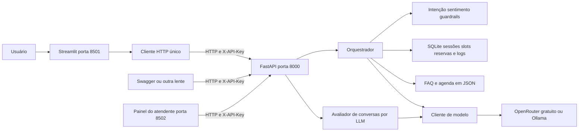

# CP2 - PLN & FrontEnd

Protótipo acadêmico de atendimento da Oficina Roda Certa fictícia. A Lia agenda uma avaliação automotiva, responde seis perguntas frequentes e transfere situações sensíveis ou reclamações para uma fila humana. Backend e frontend são projetos independentes; toda a inteligência e a memória ficam no servidor.

## Integrantes e entrega

Divisão prevista para a revisão e apresentação da entrega:

| Nome | RM | Responsabilidade |
|---|---|---|
| Lucca Phelipe Masini | 564121 | Revisar a API e apresentar o backend |
| Luiz Henrique Poss | 562177 | Revisar a interface e demonstrar o chat |
| Igor Paixão Sarak | 563726 | Revisar persona, FAQ e comportamento do bot |
| Bernardo Braga Perobeli | 562468 | Conferir os testes e demonstrar a integração |
| Felipe Stefani Honorato | 563380 | Revisar a documentação e apresentar as métricas |

Repositório GitHub público: [betitanx/CP2-PLN-FrontEnd](https://github.com/betitanx/CP2-PLN-FrontEnd). O checkpoint fixa o prazo em 04/10/2026 às 23h59.

## Arquitetura



O frontend importa somente seus componentes e seu cliente HTTP. A aplicação guarda apenas `session_id` como estado de conversa em `st.session_state`; widgets têm estado transitório gerenciado pelo Streamlit. Histórico, slots, situação e último raio-X são recuperados por `GET /sessions/{session_id}` a cada execução. As rotas validam Pydantic e delegam ao orquestrador.

## Tecnologias e modelo

Python 3.11 ou superior, FastAPI, Pydantic 2, SQLite, HTTPX, Streamlit e Requests. As versões diretas estão fixadas nos `requirements.txt` dos três projetos. Verificado localmente com Python 3.13.

Provedor padrão: OpenRouter com `google/gemma-4-26b-a4b-it:free`, com acesso isolado em `backend/app/llm/client.py`. A plataforma também oferece `nvidia/nemotron-3-super-120b-a12b:free`, de outra família.

1. Custo: os dois modelos selecionados têm preço zero no catálogo consultado em 04/10/2026; o adaptador exige preço zero de entrada, saída e requisição. É necessária uma conta com chave de API, acesso à internet e cota disponível.
2. Latência observada: Nemotron respondeu a uma classificação real em **850,22 ms**; Gemma retornou HTTP 429 em uma tentativa. Uma amostra não caracteriza desempenho médio. O lote real T1–T8 mais dez conversas teve média de **83,41 ms por turno**, incluindo regras e chamadas ao LLM; não é média exclusiva de inferência.
3. Português: o lote com Nemotron passou pelos cenários T1–T8, incluindo fallback em entradas vagas, com respostas de negócio em português e sem inventar serviços. A avaliação é dirigida e não demonstra qualidade geral. Para a avaliação final, registre o identificador selecionado, a latência e a qualidade observada; não extrapole resultados de um modelo para o outro.

LangChain não é obrigatório. Para um único modelo, uma chamada HTTP e uma janela deslizante, o cliente direto reduz dependências. O provedor pode ser trocado pelo `.env`, sem alterar regras, API ou frontend.

## Configurar o OpenRouter gratuito

Crie uma chave na [área de chaves do OpenRouter](https://openrouter.ai/settings/keys) e preencha `OPEN_ROUTER_KEY` no `backend/.env`, sem compartilhar a chave em código ou prints:

```dotenv
LLM_PROVIDER=openrouter
LLM_MODEL=google/gemma-4-26b-a4b-it:free
LLM_URL=https://openrouter.ai/api/v1
OPEN_ROUTER_KEY=sua-chave-do-openrouter
```

`API_KEY` autentica o frontend na nossa API; `OPEN_ROUTER_KEY` autentica o backend no OpenRouter. São chaves diferentes. O frontend recebe apenas `API_KEY`.

Após alterar o `.env`, reinicie o backend para carregar a nova configuração. O OpenRouter não usa a variável `LLM_API_KEY`; essa variável é exclusiva do adaptador opcional para outro provedor.

O [roteador gratuito](https://openrouter.ai/docs/cookbook/get-started/free-models-router-playground) seleciona modelos gratuitos compatíveis com os recursos solicitados. Para fixar um modelo, copie um identificador existente com sufixo `:free` do [catálogo](https://openrouter.ai/models?max_price=0). Apenas acrescentar `:free` a um modelo qualquer não cria uma versão gratuita. O projeto recusa identificadores pagos quando `LLM_PROVIDER=openrouter`, não envia uma lista de modelos alternativos nem habilita plugins pagos, e restringe preços a zero na chamada. Se não houver um endpoint gratuito compatível com JSON, retorna 503 e preserva a conversa.

### Escolher o modelo na plataforma

Na área Conversa, abra a barra lateral, selecione **Modelo** e clique em **Aplicar modelo**. A troca vale para as próximas chamadas ao LLM desta conversa e preserva histórico, slots, reservas e avaliações. Cada sessão mantém sua própria escolha no SQLite; o frontend consulta e altera essa escolha exclusivamente por HTTP. Regras e FAQ determinísticas continuam independentes do LLM.

| Opção | Identificador | Motivo da escolha |
|---|---|---|
| [Google Gemma 4 26B A4B](https://openrouter.ai/google/gemma-4-26b-a4b-it:free) | `google/gemma-4-26b-a4b-it:free` | Modelo MoE de uso geral, 3,8 bilhões de parâmetros ativos, compatível com JSON |
| [NVIDIA Nemotron 3 Super](https://openrouter.ai/nvidia/nemotron-3-super-120b-a12b:free) | `nvidia/nemotron-3-super-120b-a12b:free` | Outra família e arquitetura híbrida, 12 bilhões de parâmetros ativos, compatível com JSON |

Catálogo e preços conferidos em 04/10/2026. Isso não comprova disponibilidade da conta nem qualidade em português. Nos dois modelos, o cliente desativa raciocínio opcional para priorizar a classificação curta em JSON dentro do limite de 256 tokens. A validação Pydantic continua obrigatória.

`GET /models` lista as opções permitidas; `PATCH /sessions/{session_id}/model` recebe `{"model":"IDENTIFICADOR"}` e retorna a sessão atualizada. Ambas as rotas exigem `X-API-Key`. Um identificador fora da lista recebe 422; sessão inexistente recebe 404. O log de cada turno registra o modelo selecionado, sem afirmar que regras determinísticas utilizaram inferência. `LLM_MODEL` define o padrão de novas sessões. Se houver outro modelo gratuito configurado, inclusive `openrouter/free`, ele permanece como opção adicional para compatibilidade. Com Ollama ou outro provedor, o seletor oferece apenas o modelo configurado.

### Limites de uso

Modelos gratuitos têm limites por minuto e por dia e podem ficar indisponíveis. As cotas variam conforme a conta e a política vigente; confira [a documentação de limites](https://openrouter.ai/docs/api/reference/limits). Para consultar sua cota diária, use `GET https://openrouter.ai/api/v1/key` com `Authorization: Bearer SUA_CHAVE` em uma ferramenta local segura e consulte `data.free_model_daily_requests.used`, `limit` e `remaining`. Não publique esse retorno com dados da conta.

O projeto faz chamadas ao LLM somente para linguagem não coberta por regras, reduzindo o consumo da cota. Quando o OpenRouter retorna 429, a API devolve 503 com orientação para aguardar e o frontend mostra a mensagem. Não há repetição automática, compra de créditos ou troca automática para modelo pago. Uma conta com restrição de saldo pode receber 402 mesmo ao solicitar modelos gratuitos. As respostas não são garantidas apenas porque o catálogo lista o modelo.

O OpenRouter permite a alternativa gratuita prevista no checkpoint; o professor precisará configurar sua própria chave gratuita ou utilizar a opção local. Não inclua a chave do grupo no repositório. A seleção foi testada automaticamente. O lote T1–T8 mais dez conversas foi executado com API e Nemotron reais; resultados e limites estão em docs/metricas.md e docs/resultado_modelo_real.json. Após implementar os diferenciais, Gemma foi tentado novamente e o serviço retornou 503 com mensagem de limite gratuito ou sobrecarga, preservando a sessão; não foi possível executar seu lote completo. A nova tentativa está em docs/resultado_diferenciais.json. Nemotron também foi usado em avaliações reais de qualidade por LLM.

## Alternativa com modelo local

Instale o Ollama pelo [site oficial](https://ollama.com/download). Em um terminal:

```powershell
ollama pull qwen2.5:3b
ollama serve
```

Se o aplicativo Ollama já estiver rodando, não inicie um segundo servidor. O modelo ocupa aproximadamente 1,9 GB de download; a memória e a velocidade dependem da máquina. Configure no `backend/.env`:

```dotenv
LLM_PROVIDER=ollama
LLM_MODEL=qwen2.5:3b
LLM_URL=http://localhost:11434
OPEN_ROUTER_KEY=
```

Não é necessário publicar a porta do Ollama. Essa opção permite executar sem conta em um provedor externo.

## Executar o backend

Abra um terminal na pasta `prosa-bot`:

```powershell
cd backend
python -m venv .venv
.\.venv\Scripts\python.exe -m pip install -r requirements.txt
Copy-Item .env.example .env
```

Gere uma chave local e cole o resultado em `API_KEY=` no `.env` dos dois projetos. Preencha também a chave do OpenRouter em `OPEN_ROUTER_KEY` apenas no backend:

```powershell
.\.venv\Scripts\python.exe -c "import secrets; print(secrets.token_urlsafe(32))"
```

Inicie a API neste mesmo terminal:

```powershell
.\.venv\Scripts\python.exe -m uvicorn app.main:criar_app --factory --host 127.0.0.1 --port 8000
```

Use **um único processo**, sem `--workers`: o protótipo serializa modificações de sessão com um lock dentro do processo. A chave é obrigatória, inclusive para `/health`. `/docs` e o esquema OpenAPI são públicos para inspeção; execute apenas em localhost neste protótipo. Configurações relativas de banco são resolvidas a partir de `backend`, não da pasta de execução.

## Executar o frontend

Abra um segundo terminal na pasta `prosa-bot`:

```powershell
cd frontend
python -m venv .venv
.\.venv\Scripts\python.exe -m pip install -r requirements.txt
Copy-Item .env.example .env
```

Preencha `API_KEY` com a mesma chave do backend. `API_URL=http://localhost:8000` é a única localização de serviço que a tela conhece.

```powershell
.\.venv\Scripts\python.exe -m streamlit run app.py --server.address 127.0.0.1 --server.port 8501
```

Abra [o chat](http://localhost:8501) e [a documentação da API](http://localhost:8000/docs). No Swagger, clique em **Authorize** e informe sua chave `X-API-Key`. A interface oferece conversa, raio-X, métricas e uma fila humana consumida por HTTP. A fila é uma área da mesma aplicação; não representa uma segunda aplicação independente.

Se a API parar, a tela apresenta uma mensagem de conexão sem traceback. Em 404, oferece reiniciar a conversa; em 503, preserva a sessão. Após timeout no frontend, atualize antes de reenviar: o backend pode ter concluído a chamada. O timeout do front deve ser maior que `LLM_TIMEOUT` do backend.

## Usar uma API compatível com OpenAI

Opcionalmente, substitua estas configurações em `backend/.env`:

```dotenv
LLM_PROVIDER=openai_compatible
LLM_URL=https://api.openai.com/v1
LLM_MODEL=nome-do-modelo-habilitado-na-sua-conta
LLM_API_KEY=sua-chave-apenas-no-env
```

O adaptador usa `/chat/completions` com JSON validado por Pydantic. Escolha um modelo que aceite JSON, temperatura e `max_tokens`. Não prometa compatibilidade com todos os modelos ou provedores. A alternativa não foi testada com credenciais reais.

A API OpenAI cobra por uso conforme [a tabela oficial](https://developers.openai.com/api/docs/pricing). Não suponha camada gratuita ou acesso incluído na assinatura do ChatGPT. O enunciado admite APIs com camada gratuita e exige execução sem custo para o professor; use OpenRouter com modelos gratuitos ou a opção local. Não coloque uma chave comercial no código ou nos documentos.

## Contrato da API

Todas as rotas abaixo exigem o header `X-API-Key`. O Swagger descreve cada operação e os modelos de saída.

| Método | Rota | Resultado |
|---|---|---|
| GET | `/health` | API, provedor, modelo e disponibilidade real do modelo |
| POST | `/sessions` | 201, identificador, saudação, histórico e slots iniciais |
| POST | `/chat` | Resposta, intenção, slots, sentimento, fallback, handoff, turno, latência e situação |
| GET | `/sessions/{session_id}` | Histórico completo, slots, situação e último raio-X |
| GET | `/metrics` | Métricas calculadas dos eventos persistidos |
| DELETE | `/sessions/{session_id}` | 204, remoção de sessão e registros associados |
| POST | `/feedback` | 201, avaliação inteira de 1 a 5 |
| GET | `/handoffs` | Fila com resumo estruturado para atendente |

Exemplo de entrada do chat:

```json
{"session_id":"identificador-retornado-pela-api","message":"Quero agendar"}
```

O raio-X inclui `sentiment: {label, score}` e `handoff: {active, reason, summary}`. O resumo contém `dados`, `intencao`, `relato` e `acoes`. Autenticação inválida retorna 401, sessão inexistente 404, entrada inválida 422 e modelo indisponível ou JSON inválido 503. Um 503 não incrementa o turno nem altera slots; registra um evento técnico de erro. Regras continuam funcionando sem o LLM, mas a linguagem não coberta pelas regras exige o modelo e retorna 503 se ele estiver indisponível.

## Regras e uso do LLM

1. **Agenda e slots são código.** Nome, placa, data e horário são validados por regras. O calendário recorrente vem de `data/agenda.json` e reservas têm chave única em SQLite. Só uma confirmação explícita registra a reserva. O LLM não pode criar disponibilidade ou confirmar reservas.
2. **FAQ é curada.** `buscar_faq(pergunta)` encontra gatilhos; nas paráfrases não reconhecidas, o LLM pode selecionar um `faq_id` da base fornecida como contexto. A resposta é sempre o texto do JSON. Fora da base, admite desconhecimento e oferece caminhos. Não há embeddings, chunking ou banco vetorial.
3. **O LLM entende variações de linguagem e gera saudações ou agradecimentos.** A classificação vem em JSON validado. Respostas comerciais e transacionais são escolhidas pelo orquestrador. O texto gerado passa pelo guardrail de saída. Expressões explícitas e coleta de slots usam regras para reduzir custo e manter previsibilidade.

O sentimento é léxico: frustração e reclamação antecipam acolhimento e handoff. `score` é um indicador heurístico, não probabilidade calibrada. Após duas falhas consecutivas, incluindo erros de validação de dados, oferece um atendente; o usuário aceita com `sim` ou pede `humano`. Handoff explícito, frustração e situação sensível transferem imediatamente. Mensagens posteriores preservam o relato original e acrescentam o complemento mais recente; os demais ficam no histórico completo.

## Datas brasileiras

A conversa aceita e mostra datas em **DD/MM/AAAA**, por exemplo `06/10/2026`. A validação por código rejeita datas impossíveis e respeita dias úteis, feriados e reservas. O raio-X e o resumo humano também usam o formato brasileiro. A API, a agenda e o SQLite mantêm ISO (`2026-10-06`) para armazenamento e comparação; entradas ISO continuam aceitas para compatibilidade com outras telas. Não há inversão para mês/dia/ano.

## Memória e controle da janela

O SQLite persiste histórico e slots por `session_id`, inclusive após reiniciar a API. Cada chamada ao modelo remonta `system prompt + contexto confiável de slots/FAQ + últimas 2N falas + nova mensagem`. `CONTEXT_TURNS=8` mantém até oito pares recentes para limitar tokens e custo, sem remover o histórico completo do servidor. Os slots e os horários sugeridos ficam no contexto confiável mesmo após saírem da janela. Não há sumarização automática neste protótipo.

## Diferenciais implementados

### CSAT e contenção

`POST /feedback` recebe uma nota inteira de 1 a 5; outra nota da mesma sessão substitui a anterior. `GET /metrics` apresenta `csat_por_resultado`: conversas encerradas sem handoff, transferidas e em andamento, com quantidade de conversas, quantidade de avaliações e média de cada grupo. Sessões sem turnos não entram nessa análise. A área Métricas mostra a tabela. Contenção alta não implica satisfação alta; a média das avaliações também depende de quem respondeu. As notas das evidências são testes fictícios, não opiniões de clientes.

### Segunda lente: painel independente

O projeto `atendente/` tem dependências, configuração, cliente HTTP e processo próprios. Consulta `GET /handoffs` e, por solicitação do atendente, `GET /sessions/{session_id}`. Não importa o frontend nem o backend, não chama o LLM e não mantém memória conversacional. Esta aplicação usa Streamlit em outra porta; independência não exige outro framework.

Abra um terceiro terminal na raiz do repositório:

```powershell
cd atendente
py -m venv .venv
.\.venv\Scripts\python.exe -m pip install -r requirements.txt
Copy-Item .env.example .env
```

Preencha `API_KEY` no `atendente/.env` com a mesma chave local do backend e confira `API_URL`. Inicie:

```powershell
.\.venv\Scripts\python.exe -m streamlit run app.py --server.port 8502
```

Abra `http://localhost:8502`. Gere um handoff no chat, clique em **Atualizar fila** no painel e confira o mesmo identificador, dados, relato e histórico. O painel é de consulta; não envia respostas humanas.

### Avaliação das conversas por LLM

No chat, abra **Avaliação por LLM** e clique em **Avaliar qualidade**. A tela chama `POST /sessions/{session_id}/avaliacao`; o backend lê o histórico persistido e o modelo escolhido na sessão atribui notas de 1 a 5 para relevância, aderência à persona e retenção de contexto, com justificativas. `GET` na mesma rota recupera o último resultado salvo no SQLite. A tela avisa quando existem turnos posteriores à avaliação.

O prompt está em `backend/prompts/avaliador.md`, e o resultado passa por validação Pydantic. Abrir a tela não executa inferência; o botão faz uma chamada gratuita, sem repetição automática. Conversas sem turnos ou com registro maior que 30 mil caracteres recebem 422. Falha do provedor recebe 503 e preserva o último resultado. Apagar a sessão também apaga a avaliação. As notas não alteram CSAT, contenção ou estado do diálogo.

O avaliador recebe a persona e a FAQ como referências. É uma avaliação automática e pode errar, inclusive ao avaliar saídas do mesmo modelo; exige revisão humana. Quando a memória não foi exercitada, o prompt pede nota 3 com evidência insuficiente. Use apenas históricos fictícios.

Para avaliar um lote que ainda exista no banco do serviço, no terminal do backend:

```powershell
.\.venv\Scripts\python.exe scripts\avaliar_qualidade.py --entrada ..\docs\resultado_modelo_real.json --limite 3
```

Os identificadores do JSON devem existir no banco configurado em `DATABASE_PATH`. O script interrompe no primeiro erro e registra o resultado em `docs/avaliacao_qualidade.json`.

### Evidência de continuidade no SQLite

Foi verificada uma parada e inicialização de processos reais da API sobre o mesmo banco: três sessões conservaram histórico, slots, modelo, fila humana, métricas e feedback; uma conversa continuou no turno seguinte. Os resultados estão em [docs/resultado_diferenciais.json](docs/resultado_diferenciais.json). Para repetir: anote o `session_id`, consulte a sessão e `/metrics`, pare a API com Ctrl+C, inicie com o mesmo `DATABASE_PATH` e `API_KEY`, consulte novamente e envie a próxima mensagem. Não troque o banco nem crie outra sessão. Fechar o navegador não faz o frontend recuperar automaticamente o identificador antigo.

## Testes e métricas

No terminal do backend:

```powershell
.\.venv\Scripts\python.exe -m pip install -r requirements-dev.txt
.\.venv\Scripts\python.exe -m pytest -q
.\.venv\Scripts\python.exe -X utf8 scripts\avaliar.py --simulado
```

Os testes isolam o provedor externo com dublê e usam SQLite e rotas reais. `--simulado` é explícito e gera um banco temporário separado. Nenhum provedor fictício é habilitado na aplicação entregue. As métricas são calculadas sobre eventos efetivamente executados, mas não comprovam qualidade ou latência do LLM real. A simulação gera um resultado local; a evidência da entrega está em [docs/metricas.md](docs/metricas.md) e [docs/resultado_modelo_real.json](docs/resultado_modelo_real.json).

Para verificar os erros HTTP e a tela com API desligada, no terminal do frontend:

```powershell
.\.venv\Scripts\python.exe -m pip install -r requirements-dev.txt
.\.venv\Scripts\python.exe -m pytest -q
```

Com a API e o modelo reais ativos, use um banco novo dedicado à avaliação em `DATABASE_PATH=data/execucao/avaliacao-real.sqlite3`, reinicie a API e execute:

```powershell
.\.venv\Scripts\python.exe -X utf8 scripts\avaliar.py --modelo nvidia/nemotron-3-super-120b-a12b:free
```

O script adiciona T1–T8 e dez conversas variadas e grava `docs/resultado_modelo_real.json`. Não o execute novamente no mesmo banco de avaliação, pois existem reservas fictícias já preenchidas. Atualize o relatório com esse resultado. Execute também o roteiro manual de [docs/testes_praticos.md](docs/testes_praticos.md): o script não substitui a verificação da interação pelo Streamlit e pelo Swagger.

Contenção = conversas encerradas sem handoff / conversas com ao menos um turno concluído. Fallback = turnos em fallback / turnos concluídos. Handoff = sessões que tiveram handoff / conversas. Mensagens por conversa = turnos do usuário / conversas. Sessões ativas entram no denominador, mas não contam como contidas. Sessões vazias são excluídas. Erros 503 são contabilizados separadamente. Deletar uma sessão remove seus eventos, alterando as métricas históricas.

## Limitações conhecidas

O domínio, nomes, placas, datas e reservas são fictícios. Datas são validadas pelo calendário, dias úteis e agenda simulada, sem exigir que sejam posteriores ao dia de execução, para permitir replays acadêmicos. Nome é validado sintaticamente e não comprova identidade. A agenda é para uma única oficina e um único atendimento por horário.

O reconhecimento por gatilhos e o sentimento léxico não cobrem todas as expressões. Os guardrails reduzem riscos específicos; regex não oferece resistência universal a prompt injection. Não há retomada automática de uma sessão após fechar o navegador, autenticação individual, segregação por empresa, limitação de requisições ou operação multiworker. A chave compartilhada protege um ambiente local de demonstração, não um produto multiusuário.

O frontend recupera todo o histórico a cada atualização. O banco cresce com sessões não apagadas; retenção e paginação ficam para evolução. A fila humana não possui ferramenta de resposta nem SLA. O direito ao esquecimento remove registros acessíveis pela aplicação, mas não representa apagamento forense de páginas SQLite, backups ou dados já enviados a provedores externos.

**Entrega:** código, identificação do grupo, avaliação real, relatório e evidências estão disponíveis neste repositório.

## Arquivos para avaliação

| Arquivo ou pasta | Conteúdo |
|---|---|
| `backend/` | API, bot, prompt, FAQ, agenda, configuração, testes e script de avaliação |
| `frontend/` | Interface, cliente HTTP, configuração e testes |
| `atendente/` | Segunda aplicação independente para consultar a fila e o histórico |
| [Ficha do bot](docs/ficha_do_bot.md) | Persona, capacidades, limites e exemplos de conversa |
| [Relatório de métricas](docs/metricas.md) | Resultados reais, análise e melhoria proposta |
| [Dados da avaliação](docs/resultado_modelo_real.json) | T1–T8 e dez conversas, com histórico fictício e estado final |
| [Diferenciais](docs/resultado_diferenciais.json) | Reinício real, CSAT por resultado, avaliações por LLM e nova tentativa com Gemma |
| [Testes práticos](docs/testes_praticos.md) | Resultados e roteiro para repetir os cenários |
| `docs/prints/` | Chat, Swagger, seleção de modelos, slots, handoff e métricas |

## Uso de IA generativa

O código inicial, os testes automatizados, o prompt e a documentação foram produzidos com apoio do Codex a partir do enunciado. FastAPI, Pydantic e Streamlit fornecem infraestrutura; as regras, o orquestrador, a coleta de slots e o cálculo das métricas foram escritos para este caso. Não foi adaptado um bot do Botpress, pois nenhum projeto anterior foi fornecido. O grupo deve revisar, compreender e assumir o que entregar, registrando suas próprias alterações e a divisão real de responsabilidades.

## Referências técnicas

- [API do OpenRouter](https://openrouter.ai/docs/api/reference/overview)
- [Roteador gratuito do OpenRouter](https://openrouter.ai/docs/cookbook/get-started/free-models-router-playground)
- [Limites de uso do OpenRouter](https://openrouter.ai/docs/api/reference/limits)
- [API de chat do Ollama](https://docs.ollama.com/api/chat)
- [Modelo Qwen 2.5 de 3 bilhões de parâmetros](https://ollama.com/library/qwen2.5:3b)
- [Componentes de chat do Streamlit](https://docs.streamlit.io/develop/api-reference/chat/st.chat_input)
- [Segurança no FastAPI](https://fastapi.tiangolo.com/tutorial/security/first-steps/)

A validação prática atual está em [docs/testes_praticos.md](docs/testes_praticos.md). O relatório registra o que foi exercitado pela interface, pelo serviço HTTP e pelos testes automatizados.
